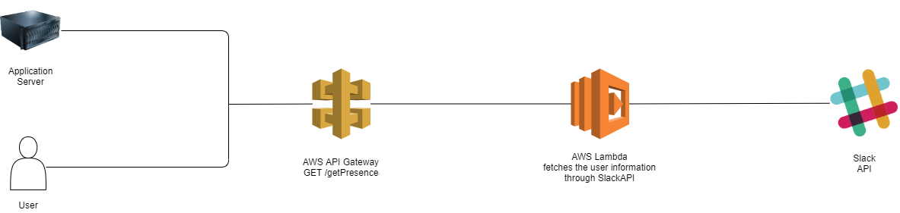

# slack-presence-proxy

Anybody will be able to see your availability during the home office without Slack account. You just have to provide the public HTTP endpoint for your service.

## Software Architecture Overview

## Configuration

- `SLACK_USER_SECRET` - User to get presence info on. This is the authed user.

- `SLACK_AUTH_TOKEN` - Authentication token bearing required scopes.
